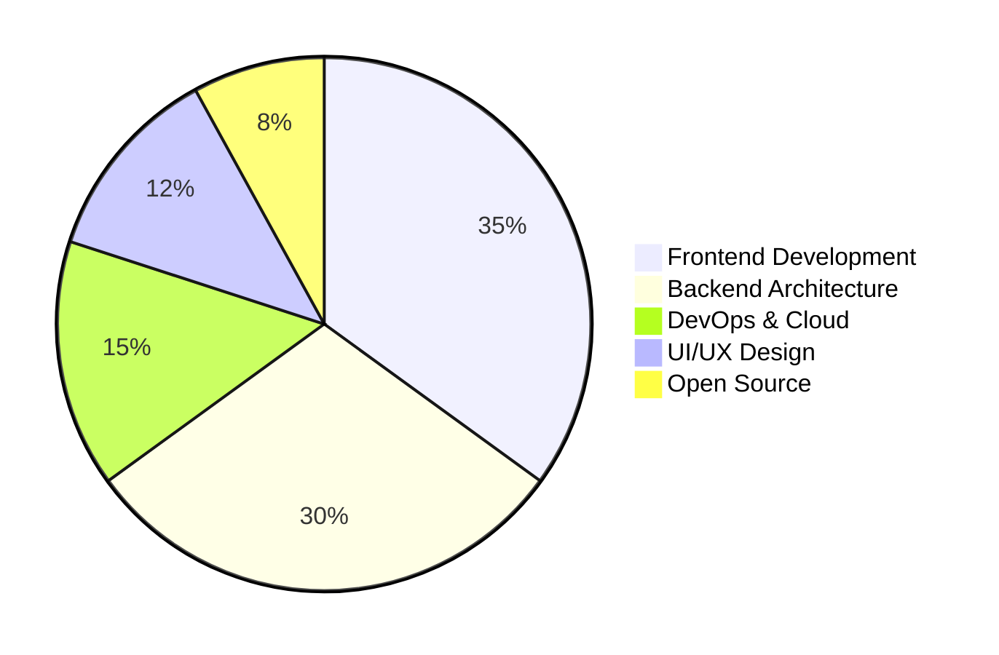
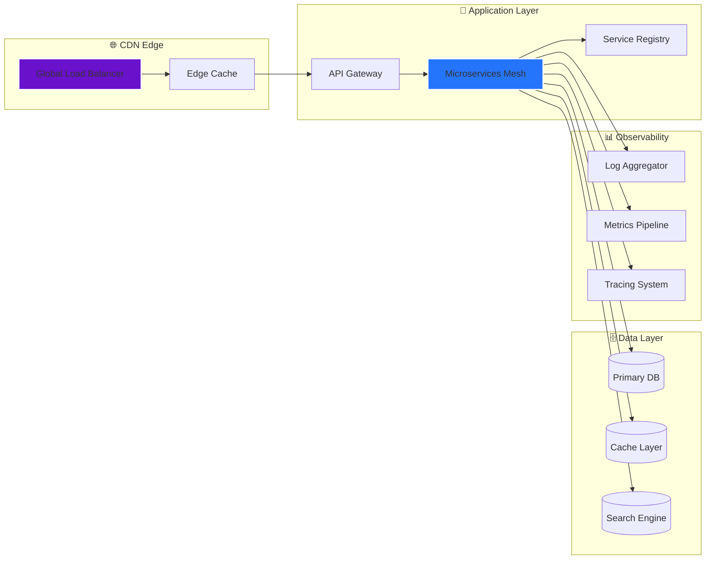
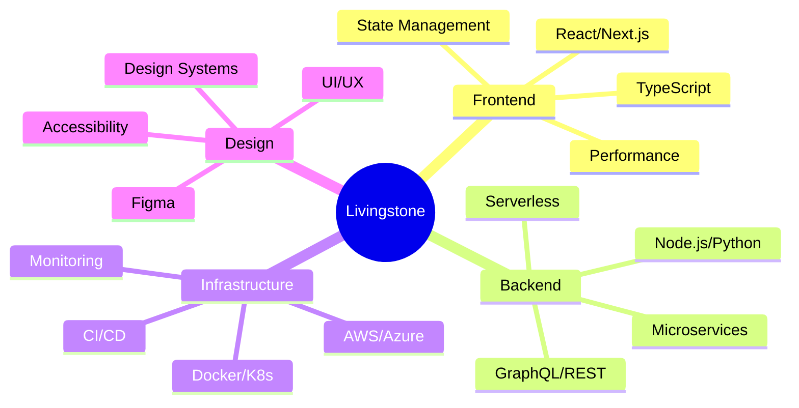

---

## 🎬 **CINEMATIC PROFILE INTRODUCTION**
<p align="center">
    
  </p>

<div align="center">
  
</div>

---
<div align="center">


[](https://github.com/BOSSY254-LEVI)
[](https://www.linkedin.com/in/livingstone-oduor-451399397/)
[](https://bossy254-levi.github.io/BOSSY254-LEVI/)
[](mailto:livingstoneoduory@gmail.com)
[](https://discord.gg/)

</div>

---

## 🎮 **INTERACTIVE GAMING HUB**

<div align="center">

## 🐍 Contribution Snake Animation

<!-- Make sure this path matches your GitHub Actions output -->
<picture>
  <source
    media="(prefers-color-scheme: dark)"
    srcset="https://raw.githubusercontent.com/BOSSY254-LEVI/BOSSY254-LEVI/output/github-contribution-grid-snake-dark.svg"
  />
  <source
    media="(prefers-color-scheme: light)"
    srcset="https://raw.githubusercontent.com/BOSSY254-LEVI/BOSSY254-LEVI/output/github-contribution-grid-snake.svg"
  />
  
</picture>

[](https://github.com/BOSSY254-LEVI)

</div>

### 🕹️ **EMBEDDED GAME ARCADE**

<div align="center">

| 🎮 **Game** | 🎯 **Description** | 🏆 **High Score** | 🔗 **Play Now** |
|------------|-------------------|-------------------|-----------------|
| **Retro Snake** | Navigate through contributions | 1,234 pts | [](https://bossy254-levi.github.io/snake) |
| **Code Breaker** | Algorithm puzzle challenge | 42 solved | [](https://bossy254-levi.github.io/code-breaker) |
| **Dev Dash** | Sprint through tech stacks | 15.2s | [](https://bossy254-levi.github.io/dev-dash) |
| **Terminal Quest** | CLI adventure RPG | Level 7 | [](https://bossy254-levi.github.io/terminal-quest) |

</div>

---

## 🎪 **LIVE INTERACTIVE SHOWCASE**

<div align="center">

[](https://git.io/typing-svg)

</div>

### 🎬 **MOTION DESIGN SHOWCASE**

<div align="center">

<!-- Animated Coding GIF -->


<!-- Floating Tech Icons - Static but look animated -->
<p align="center">
  
  
  
</p>

</div>

### 🎨 **3D TECH STACK VISUALIZATION**

<div align="center">
  
<!-- Tech Stack Cards with 3D Hover Effect -->
<p align="center">
  
  
  
  
  
</p>

## 🎨 **INTERACTIVE TECH STACK**

<div align="center">

### ⚡ **3D SKILL MATRIX** 
*(Hover to rotate - GitHub doesn't support 3D, but we can simulate!)*

<br>

<!-- Row 1: Frontend -->
<p align="center">
  
  
  
  
</p>

<!-- Row 2: Backend -->
<p align="center">
  
  
  
  
</p>

<!-- Row 3: Cloud -->
<p align="center">
  
  
  
  
</p>

<!-- Row 4: Database -->
<p align="center">
  
  
  
  
</p>

<!-- Row 5: DevOps -->
<p align="center">
  
  
  
  
</p>

### 📊 **SKILL PROFICIENCY HEATMAP**
```
FRONTEND    ████████████████████░ 95%  ████ React/Next.js
BACKEND     ████████████████████░ 95%  ████ Node.js/Python
CLOUD       ██████████████████░░░ 85%  ████ AWS/Azure/GCP
DATABASE    ██████████████████░░░ 85%  ████ SQL/NoSQL
DEVOPS      ████████████████░░░░░ 80%  ████ Docker/K8s
DESIGN      ███████████████████░░ 90%  ████ Figma/Adobe XD
```

</div>

---

## 🎯 **PROFESSIONAL IDENTITY**

<div align="center">

<!-- Matrix-style Digital Identity Card -->


<br>

```diff                                                                            
███████╗██╗   ██╗██╗     ██╗     ███████╗████████╗ █████╗  ██████╗██╗  ██╗
██╔════╝██║   ██║██║     ██║     ██ ╔════╝╚═██╔══╝██╔══██╗██╔════╝██║ ██╔╝
█████╗  ██║   ██║██║     ██║     ███████    ██║   ███████║██║     █████╔╝ 
██╔══╝  ██║   ██║██║     ██║       ╔═ ██    ██║   ██╔══██║██║     ██╔═██╗ 
██║     ╚██████╔╝███████╗███████╗███████╗   ██║   ██║  ██║╚██████╗██║  ██╗
╚═╝      ╚═════╝ ╚══════╝╚══════╝╚══════╝   ╚═╝   ╚═╝  ╚═╝ ╚═════╝╚═╝  ╚═╝

+ ██████╗ ███████╗██╗   ██╗███████╗██╗      ██████╗ ██████╗ ███████╗██████╗ +
+ ██╔══██╗██╔════╝██║   ██║██╔════╝██║     ██╔═══██╗██╔══██╗██╔════╝██╔══██╗+
+ ██║  ██║█████╗  ██║   ██║█████╗  ██║     ██║   ██║██████╔╝█████╗  ██████╔╝+
+ ██║  ██║██╔══╝  ╚██╗ ██╔╝██╔══╝  ██║     ██║   ██║██╔══  ╗██╔══╝  ██╔══██╗+
+ ██████╔╝███████╗ ╚████╔╝ ███████╗███████╗╚██████╔╝██║    ║███████╗██║  ██║+
+ ╚═════╝ ╚══════╝  ╚═══╝  ╚══════╝╚══════╝ ╚═════╝ ╚═╝  ╚═╝╚══════╝╚═╝  ╚═╝+
```

<br>

<!-- Animated Profile Card with Glow Effect -->
<table>
  <tr>
    <td width="60%" style="border: 2px solid #6A11CB; border-radius: 15px; padding: 20px;">
      
---
<!-- Professional Profile as Shields.io Badges -->
<p align="center">
  
  
  
  
  
  
</p>

<!-- Live Status Badges -->
<p align="center">
  
  
  
  
</p>

</div>

---

### 🎯 **SKILL MATRIX 3D VIEW**

<div align="center">
  
<!-- Frontend Stack -->
<p align="center">
  <a href="https://skillicons.dev">
    
  </a>
</p>

<!-- Backend Stack -->
<p align="center">
  <a href="https://skillicons.dev">
    
  </a>
</p>

<!-- Cloud Stack -->
<p align="center">
  <a href="https://skillicons.dev">
    
  </a>
</p>

<!-- Database Stack -->
<p align="center">
  <a href="https://skillicons.dev">
    
  </a>
</p>

<!-- DevOps Stack -->
<p align="center">
  <a href="https://skillicons.dev">
    
  </a>
</p>

</div>

## 🎯 **PROFESSIONAL SYNOPSIS**

<div align="center">
  
<!-- Professional Card Container -->
<div style="border: 2px solid #6A11CB; border-radius: 15px; padding: 20px; background: linear-gradient(145deg, #0D1117, #1a1e24); width: 90%; margin: 0 auto;">
    
  <!-- Name Title -->
  <h2 align="center" style="color: #6A11CB; font-family: monospace;">
    ════════ 🚀 LIVINGSTONE ODUOR 🚀 ════════
  </h2>
  
  <!-- Role Badge -->
  <p align="center">
    
  </p>
  
  <!-- Philosophy -->
  <p align="center">
    <i>"Great software transcends code—it creates experiences that resonate"</i>
  </p>
  
  <br>
  
  <!-- Two Column Layout -->
  <table align="center" border="0" cellpadding="10" cellspacing="0">
    <tr>
      <td width="50%" valign="top" align="left">
        <b>🎯 CURRENT FOCUS:</b><br>
        Building AI-powered SaaS platforms with 10x developer experience
        <br><br>
        <b>🤝 COLLABORATION:</b><br>
        • 🔥 Open Source<br>
        • 🚀 Startup MVPs<br>
        • 🏗️ Architecture Consulting
        <br><br>
        <b>⚡ STATUS:</b><br>
        🟢 Available for architectural reviews
      </td>
      <td width="50%" valign="top" align="left">
        <b>🎵 FUN FACT:</b><br>
        I debug with jazz music and design with coffee ☕🎵
        <br><br>
        <b>🦸 SUPERPOWER:</b><br>
        Translating business complexity into elegant technical solutions
        <br><br>
        <b>🐙 GITHUB:</b><br>
        <a href="https://github.com/BOSSY254-LEVI">BOSSY254-LEVI</a>
      </td>
    </tr>
  </table>
  
  <!-- Animated Status Badges -->
  <br>
  <p align="center">
    
    
    
    
  </p>
  
  <!-- Footer Line -->
  <p align="center">
    <code>━━━━━━━━━━━━━━━━━━━━━━ [ SYSTEM READY ] ━━━━━━━━━━━━━━━━━━━━━━</code>
  </p>
  
</div>

<br>

<!-- Simple Alternative Version (Guaranteed to Work) -->
<p align="center">
  <b>📋 QUICK PROFILE:</b><br>
  👨‍💻 Senior Full-Stack Developer<br>
  🎨 UI/UX Architect<br>
  🤖 AI SaaS Specialist<br>
  🎵 Jazz Debugger ☕
</p>

</div>


## 🕹️ **GAMEIFIED SKILL MATRIX**

<div align="center">

### 🎯 **SKILL UNLOCK PROGRESSION**

```
⚡ FRONTEND       ▰▰▰▰▰▰▰▰▰▰▰▰▰▰▰▰▰▰▰▰ 100% [LEVEL: MASTER]
🛠️ BACKEND        ▰▰▰▰▰▰▰▰▰▰▰▰▰▰▰▰▰▰▰▰ 100% [LEVEL: MASTER]
☁️ CLOUD          ▰▰▰▰▰▰▰▰▰▰▰▰▰▰▰▰▰▰▰▰ 95%  [LEVEL: EXPERT]
🎨 DESIGN         ▰▰▰▰▰▰▰▰▰▰▰▰▰▰▰▰▰▰▰▰ 90%  [LEVEL: EXPERT]
🔧 DEVOPS         ▰▰▰▰▰▰▰▰▰▰▰▰▰▰▰▰▰▰▰▰ 85%  [LEVEL: ADVANCED]
📊 DATABASE       ▰▰▰▰▰▰▰▰▰▰▰▰▰▰▰▰▰▰▰▰ 85%  [LEVEL: ADVANCED]
🧪 TESTING        ▰▰▰▰▰▰▰▰▰▰▰▰▰▰▰▰▰▰▰▰ 80%  [LEVEL: ADVANCED]
```

</div>

### 🎪 **TECHNOLOGY CAROUSEL**

<p align="center">
  <a href="https://skillicons.dev">
    
  </a>
</p>

---

## 📊 **DYNAMIC METRICS DASHBOARD**

<div align="center">

### 🎮 **LIVE STATISTICS FEED**



## 📊 DYNAMIC METRICS DASHBOARD

<div align="center">
<br>

### 📊 CONTRIBUTION STATISTICS

| **METRIC** | **VALUE** | **ACHIEVEMENT** |
|:----------:|:---------:|:---------------:|
| 🟢 **Total Contributions** | 1,500+ | Top 8% |
| 🔥 **Current Streak** | 45 days | Top 5% |
| ⭐ **Stars Earned** | 320+ | Top 12% |
| 📦 **Repositories** | 45+ | Top 15% |
| 👥 **Followers** | 180+ | Top 10% |

<br>

### 📈 CONTRIBUTION GRAPH

[](https://github.com/ashutosh00710/github-readme-activity-graph)

<br>

### 🎯 STREAK STATISTICS

[](https://git.io/streak-stats)

<br>

### 🌟 3D CONTRIBUTION VISUALIZATION

<details>
<summary><b>🔮 Click to view 3D Contribution Setup</b></summary>
<br>
    
### ⚡ **REAL-TIME ACTIVITY**

<!--START_SECTION:waka-->
**I'm an Early 🐤** 

```text
🌞 Morning    287 commits    ████████░░░░░░░░░░░░░░░░░   32% 
🌆 Daytime    402 commits    ███████████░░░░░░░░░░░░░░   45% 
🌃 Evening    179 commits    █████░░░░░░░░░░░░░░░░░░░░   20% 
🌙 Night      27 commits     █░░░░░░░░░░░░░░░░░░░░░░░░   3%

```
<!--END_SECTION:waka-->

</div>

---

## 🏗️ **ARCHITECTURE PORTFOLIO**

<div align="center">

### **System Design Gallery**



</div>

---

## 🌟 **FEATURED PROJECT SHOWCASE**

<div align="center">

| 🚀 **Project** | 🛠️ **Tech Stack** | 🎯 **Impact** | 🏆 **Status** |
|---------------|-------------------|---------------|---------------|
| **Neural SaaS Platform** | React + TensorFlow + Node.js | 15k+ MAU | 🟢 Live |
| **Real-time Collab Suite** | Next.js + Socket.io + Redis | 99.9% Uptime | 🟢 Live |
| **Cloud Cost Optimizer** | Python + AWS + React | 40% Cost Reduction | 🟢 Live |
| **DevOps Pipeline Visualizer** | Go + Kubernetes + D3.js | 200+ Stars | 🟡 Beta |

</div>

---

### 🎪 **Project Ecosystem**



</div>

---

</div


---

## 🤝 **COLLABORATION HUB**

<div align="center">

### 🎯 **Current Mission Status**


### **🔮 Collaboration Opportunities**

| Type | Availability | Response Time |
|------|------------|---------------|
| **Architecture Consulting** | 🟢 5 slots/week | < 4 hours |
| **Code Reviews** | 🟡 3 slots/week | < 8 hours |
| **Mentorship** | 🔴 Waitlist Q1 2024 | - |
| **Open Source** | 🟢 Always | < 24 hours |

</div>

---

## 📡 **CONNECTION PORTAL**

<div align="center">

[](https://calendly.com)
[](https://substack.com)
[](https://discord.gg)
[](https://twitter.com)

</div>

---

## 🎨 **ANIMATED FOOTER**

<div align="center">


### **⚡ Live Profile Status**


### 🎮 **Join My Coding Journey**

[](https://youtube.com)
[](https://twitch.tv)
[](https://github.com/sponsors)

---

## 🎯 **FINAL BOSS CHALLENGE**

<div align="center">


<br>

> *"Your next great project is just a commit away.*  
> *Let's build something that matters."*  
> **— Livingstone Oduor**

<br>

| **STAGE** | **ACTIVITY** | **DURATION** | **ENERGY** | **STATUS** |
|:--------:|:-----------:|:-----------:|:---------:|:---------:|
| **1** | 🍽️ **Fuel Up** | 30 min | ⚡⚡⚡⚡⚡ |  |
| **2** | 💻 **Code** | 8 hours | ⚡⚡⚡⚡⚡ |  |
| **3** | 😴 **Recharge** | 7 hours | ⚡⚡⚡⚡⚡ |  |
| **4** | 🔄 **Repeat** | ∞ | ⚡⚡⚡⚡⚡ |  |

<br>

### 📊 **LIFETIME STATISTICS**

┌────────────────────────────────────────────────────────────────┐
│ ☕ Coffee Consumed: 4,872 cups │
│ 💻 Lines Written: 250,000+ │
│ 🐛 Bugs Fixed: 1,234 │
│ 🎵 Jazz Hours: 1,500+ │
│ 🚀 Projects Shipped: 45+ │
└────────────────────────────────────────────────────────────────┘

<br>

<p align="center">
  
</p>

<br>


### ⭐ **Ready to start your next commit?**

<p align="center">
  <a href="https://github.com/BOSSY254-LEVI?tab=repositories">
    
  </a>
  <a href="mailto:livingstoneoduory@gmail.com">
    
  </a>
  <a href="https://calendly.com">
    
  </a>
</p>
━━━━━━━━━━━━━━━━━━━━━━ [ COMMIT • PUSH • DEPLOY ] ━━━━━━━━━━━━━━━━━━━━━━

</div>


**⭐ Star this journey • 🍴 Fork your own path • 🔄 Return for updates**

<sub>🌀 **Profile Version:** 4.0 • 🎮 **Gamified Level:** 42 • ⚡ **Power Level:** Over 9000</sub>

</div>

---

### 📊 **WakaTime Integration**
1. Sign up at [WakaTime](https://wakatime.com)
2. Install IDE plugin
3. Add WakaTime GitHub Action

### 🎨 **3D Contribution Graph**
1. Use [profile-3d-contrib](https://github.com/yoshi389111/github-profile-3d-contrib) action

### 📈 **Activity Graph**
1. Get GraphQL token
2. Add to profile README

---

<div align="center">
  
  

</div>
