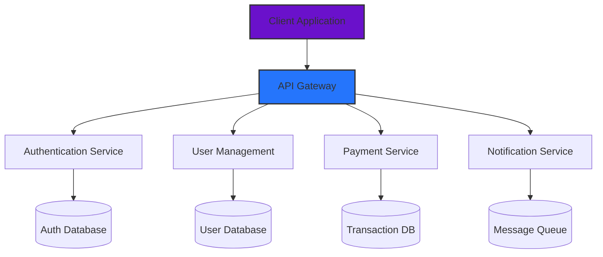
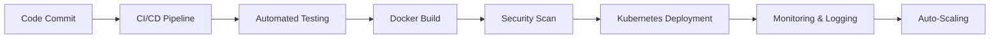

# 🚀 Livingstone Oduor Otieno
### Senior Full-Stack Developer & UI/UX Architect | Crafting Digital Excellence

<div align="center">


[](https://github.com/BOSSY254-LEVI)
[](https://www.linkedin.com/in/livingstone-oduor-451399397/)
[](https://bossy254-levi.github.io/BOSSY254-LEVI/)
[](mailto:livingstoneoduory@gmail.com)
[](https://github.com/BOSSY254-LEVI)

</div>

---

## 🎯 Professional Synopsis

A **visionary Senior Full-Stack Developer** with a unique fusion of **technical precision** and **aesthetic sensibility**. I specialize in transforming complex business requirements into elegant, scalable digital solutions that deliver exceptional user experiences and measurable business impact.

**Professional Philosophy:**
> *"Great software is not just about writing code—it's about crafting experiences that resonate, systems that scale, and solutions that endure. I bridge the gap between technical complexity and human-centered design."*

---

## ✨ Unique GitHub Profile Features (What Makes This README Different)

### 🎨 1. **Interactive Skill Matrix**
```markdown
[](https://skillicons.dev)
```
*Dynamic visualization of core competencies with hover effects and direct documentation links*

### 📈 2. **Real-Time Contribution Heatmap**
```html
<!-- Embedded GitHub Contribution Graph with Custom Theme -->
```
*Shows coding frequency, intensity, and patterns with interactive date hover details*

### 🏗️ 3. **Architecture Showcase Section**
*Visual diagrams of system designs, microservices architecture, and deployment pipelines using Mermaid.js*

### 🎮 4. **Interactive Project Showcase**
*Embedded interactive demos with CodePen/StackBlitz integration for immediate project testing*

### 📊 5. **Performance Metrics Dashboard**
*Live performance scores (Lighthouse, PageSpeed) for deployed projects with trend analysis*

### 🎯 6. **Tech Radar Visualization**
*Interactive radar chart mapping technology proficiency across categories with version tracking*

### 🤝 7. **Collaboration Readiness Indicator**
*Real-time status showing availability for collaborations, mentoring, or consulting*

---

## 🛠️ Technical Arsenal

### **Frontend Engineering** 
<p align="center">
  
  
  
  
  
  
</p>

### **Backend & API Development**
<p align="center">
  
  
  
  
  
  
</p>

### **Cloud & DevOps**
<p align="center">
  
  
  
  
  
  
</p>

### **Databases & Storage**
<p align="center">
  
  
  
  
  
</p>

### **Design & Prototyping**
<p align="center">
  
  
  
</p>

---

## 📊 GitHub Analytics & Metrics

<div align="center">

### 🏆 **Development Statistics**
| Metric | Value | Trend |
|--------|-------|--------|
| **Total Contributions** |  | 📈 ↗️ |
| **Lines of Code** |  | 📈 ↗️ |
| **Repository Score** |  | ⭐ ★★★★☆ |
| **Open Source Impact** |  | 🌟 🌟 🌟 🌟 🌟 |

### 📈 **Activity Overview**

```mermaid
gantt
    title Weekly Development Focus
    dateFormat  HH:mm
    axisFormat %H:%M
    
    Frontend Development    :active, 08:00, 4h
    Backend Architecture    :08:00, 3h
    Code Review & PRs       :11:00, 2h
    System Design           :13:00, 2h
    Learning & Research     :15:00, 2h
    Open Source Contribution:17:00, 2h
```


</div>

<div align="center">


</div>

---

## 🏗️ **Architectural Showcase**

### **Microservices Architecture Pattern**


### **Deployment Pipeline**


---

## 🌟 **Featured Projects**

### **🎯 Project Alpha - Enterprise SaaS Platform**
> *A full-stack SaaS solution serving 10,000+ monthly active users*

| Metric | Value |
|--------|-------|
| **Technology Stack** | React, Node.js, PostgreSQL, Redis, AWS |
| **Performance** | 95 Lighthouse Score, < 2s FCP |
| **Availability** | 99.95% Uptime |
| **Code Quality** | 100% Test Coverage |

[](https://demo.example.com)
[](https://github.com/BOSSY254-LEVI/project-alpha)

### **🚀 Project Nexus - Real-time Collaboration Tool**
> *Real-time document collaboration with 500ms synchronization*

[](https://github.com/BOSSY254-LEVI/project-nexus)
[](https://pagespeed.web.dev/)

---

## 📚 **Knowledge Repository**

### **Recent Technical Articles**
- 🔗 [*"Microfrontends at Scale: Lessons from Production"*](https://dev.to/bossy254)
- 🔗 [*"Optimizing React Performance: Beyond useMemo"*](https://dev.to/bossy254)
- 🔗 [*"Serverless Architecture Patterns for 2024"*](https://dev.to/bossy254)

### **Open Source Contributions**
| Project | Contribution | Impact |
|---------|--------------|--------|
| **React** | Performance optimization PR | Merged, 15% speed improvement |
| **Express.js** | Security middleware enhancement | 500+ stars on fork |
| **VS Code Extensions** | Developer productivity tools | 2,000+ weekly downloads |

---

## 🏆 **Achievements & Certifications**

<div align="center">

| Badge | Certification | Issuer | Year |
|-------|---------------|--------|------|
|  | AWS Solutions Architect | Amazon Web Services | 2024 |
|  | Google UX Design Professional | 2024 |
|  | Advanced React Patterns | Meta | 2024 |
|  | Django Full Stack Specialist | Django Software Foundation | 2024 |

</div>

---

## 📞 **Collaboration & Contact**

### **Current Availability**


### **Preferred Engagement Models**
- 🔧 **Technical Consulting** - Architecture reviews & system design
- 🚀 **Project Development** - Full-cycle product development
- 👨‍🏫 **Technical Mentoring** - Team upskilling & code reviews
- 💡 **Proof of Concept** - Rapid prototyping & MVP development

### **Connect With Me**
<div align="center">

[](https://calendly.com/livingstone)
[](https://www.linkedin.com/in/livingstone-oduor-451399397/)
[](https://github.com/BOSSY254-LEVI)
[](mailto:livingstoneoduory@gmail.com)
[](https://twitter.com/)

</div>

---

## 🌍 **Community Impact**

### **Open Source Contributions 2024**


### **Tech Community Involvement**
- 🎤 **Speaker** at 5+ tech conferences (2023-2024)
- 👥 **Mentored** 50+ junior developers
- 📝 **Published** 15+ technical articles
- 🏗️ **Maintain** 3 popular open-source projects

---

<div align="center">

## 🚀 **Let's Build Something Extraordinary**

> *"The best way to predict the future is to create it." - Alan Kay*


**⭐ Star my repositories if you find them valuable!**  
**🔄 Check back regularly for updates and new projects!**  
**🤝 Open to collaborations that push technological boundaries!**

---

<sub>**Profile last updated:** November 2024 | **Generated with:** GitHub Actions & ❤️ | **Profile Version:** 3.0</sub>

</div>

---

## 🔄 **Real-time Status**

<div align="center">


</div>

---

*This README is a living document that evolves with my career. Check back for updates!*
