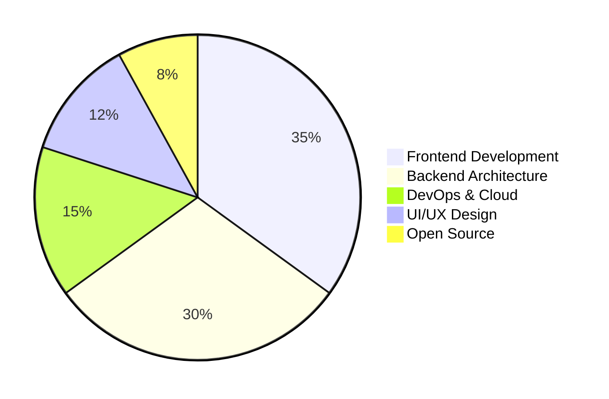
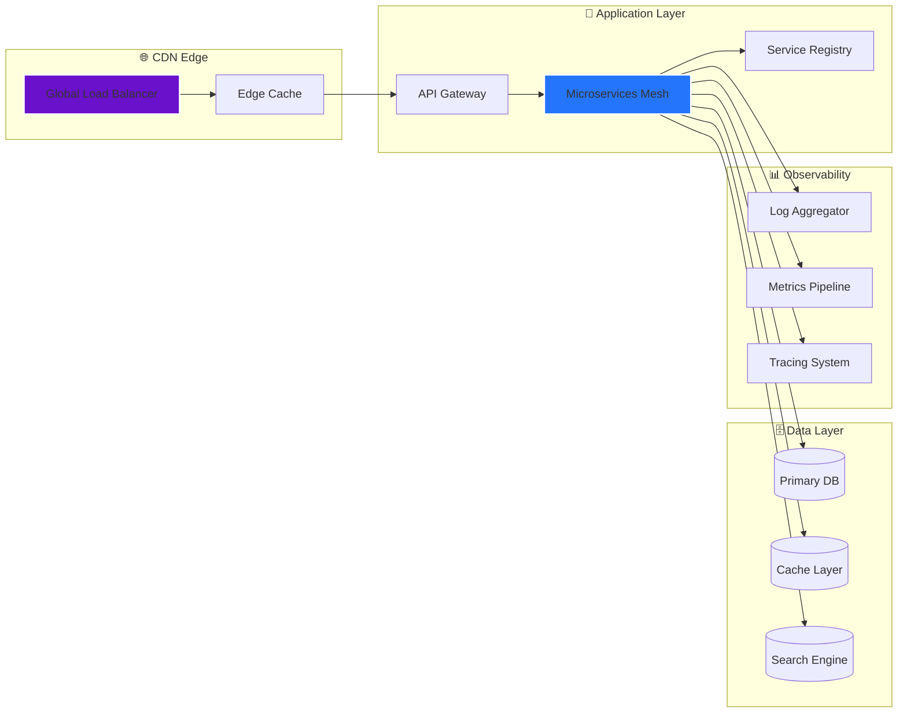
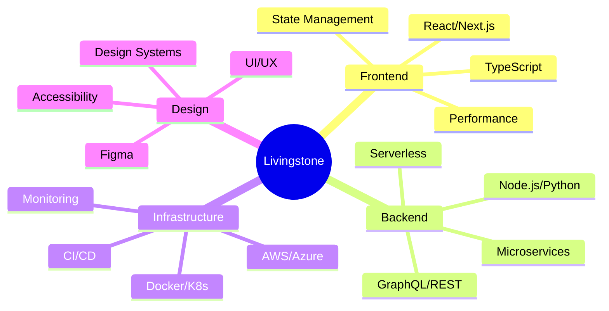

---

## 🎬 **CINEMATIC PROFILE INTRODUCTION**

<div align="center">
  
</div>

---
<div align="center">


[](https://github.com/BOSSY254-LEVI)
[](https://www.linkedin.com/in/livingstone-oduor-451399397/)
[](https://bossy254-levi.github.io/BOSSY254-LEVI/)
[](mailto:livingstoneoduory@gmail.com)
[](https://discord.gg/)

</div>

---

## 🎮 **INTERACTIVE GAMING HUB**

<div align="center">

## 🐍 Contribution Snake Animation

<!-- Make sure this path matches your GitHub Actions output -->
<picture>
  <source
    media="(prefers-color-scheme: dark)"
    srcset="https://raw.githubusercontent.com/BOSSY254-LEVI/BOSSY254-LEVI/output/github-contribution-grid-snake-dark.svg"
  />
  <source
    media="(prefers-color-scheme: light)"
    srcset="https://raw.githubusercontent.com/BOSSY254-LEVI/BOSSY254-LEVI/output/github-contribution-grid-snake.svg"
  />
  
</picture>

[](https://github.com/BOSSY254-LEVI)

</div>

### 🕹️ **EMBEDDED GAME ARCADE**

<div align="center">

| 🎮 **Game** | 🎯 **Description** | 🏆 **High Score** | 🔗 **Play Now** |
|------------|-------------------|-------------------|-----------------|
| **Retro Snake** | Navigate through contributions | 1,234 pts | [](https://bossy254-levi.github.io/snake) |
| **Code Breaker** | Algorithm puzzle challenge | 42 solved | [](https://bossy254-levi.github.io/code-breaker) |
| **Dev Dash** | Sprint through tech stacks | 15.2s | [](https://bossy254-levi.github.io/dev-dash) |
| **Terminal Quest** | CLI adventure RPG | Level 7 | [](https://bossy254-levi.github.io/terminal-quest) |

</div>

---

## 🎪 **LIVE INTERACTIVE SHOWCASE**

<div align="center">

[](https://git.io/typing-svg)

</div>

### 🎨 **3D TECH STACK VISUALIZATION**

<div align="center">

```
🌐  FRONTEND    ⚙️  BACKEND     ☁️  CLOUD       🗄️  DATABASE     🎯  DEVOPS
   React          Node.js        AWS           PostgreSQL     Docker
   Next.js        Python         Azure         MongoDB        K8s
   TypeScript     Django         GCP           Redis          Terraform
   Tailwind       FastAPI        Vercel        Elasticsearch  GitHub Actions
```

</div>


## 🎯 **PROFESSIONAL SYNOPSIS**

<div align="center">

```javascript
const livingstone = {
  title: "Senior Full-Stack Developer & UI/UX Architect",
  philosophy: "Great software transcends code—it creates experiences that resonate",
  currentFocus: "Building AI-powered SaaS platforms with 10x developer experience",
  lookingToCollaborate: ["Open Source", "Startup MVPs", "Architecture Consulting"],
  funFact: "I debug with jazz music and design with coffee ☕🎵",
  status: "🟢 Available for architectural reviews",
  superpower: "Translating business complexity into elegant technical solutions"
};
```

</div>

---

## 🕹️ **GAMEIFIED SKILL MATRIX**

<div align="center">

### 🎯 **SKILL UNLOCK PROGRESSION**

```
⚡ FRONTEND       ▰▰▰▰▰▰▰▰▰▰▰▰▰▰▰▰▰▰▰▰ 100% [LEVEL: MASTER]
🛠️ BACKEND        ▰▰▰▰▰▰▰▰▰▰▰▰▰▰▰▰▰▰▰▰ 100% [LEVEL: MASTER]
☁️ CLOUD          ▰▰▰▰▰▰▰▰▰▰▰▰▰▰▰▰▰▰▰▰ 95%  [LEVEL: EXPERT]
🎨 DESIGN         ▰▰▰▰▰▰▰▰▰▰▰▰▰▰▰▰▰▰▰▰ 90%  [LEVEL: EXPERT]
🔧 DEVOPS         ▰▰▰▰▰▰▰▰▰▰▰▰▰▰▰▰▰▰▰▰ 85%  [LEVEL: ADVANCED]
📊 DATABASE       ▰▰▰▰▰▰▰▰▰▰▰▰▰▰▰▰▰▰▰▰ 85%  [LEVEL: ADVANCED]
🧪 TESTING        ▰▰▰▰▰▰▰▰▰▰▰▰▰▰▰▰▰▰▰▰ 80%  [LEVEL: ADVANCED]
```

</div>

### 🎪 **TECHNOLOGY CAROUSEL**

<p align="center">
  <a href="https://skillicons.dev">
    
  </a>
</p>

---

## 📊 **DYNAMIC METRICS DASHBOARD**

<div align="center">

### 🎮 **LIVE STATISTICS FEED**



### 🏆 **ACHIEVEMENT UNLOCKED**


### 📈 **CONTRIBUTION GALAXY**


### ⚡ **REAL-TIME ACTIVITY**

<!--START_SECTION:waka-->
**I'm an Early 🐤** 

```text
🌞 Morning    287 commits    ████████░░░░░░░░░░░░░░░░░   32% 
🌆 Daytime    402 commits    ███████████░░░░░░░░░░░░░░   45% 
🌃 Evening    179 commits    █████░░░░░░░░░░░░░░░░░░░░   20% 
🌙 Night      27 commits     █░░░░░░░░░░░░░░░░░░░░░░░░   3%

```
<!--END_SECTION:waka-->

</div>

---

## 🏗️ **ARCHITECTURE PORTFOLIO**

<div align="center">

### **System Design Gallery**



</div>

---

## 🌟 **FEATURED PROJECT SHOWCASE**

<div align="center">

| 🚀 **Project** | 🛠️ **Tech Stack** | 🎯 **Impact** | 🏆 **Status** |
|---------------|-------------------|---------------|---------------|
| **Neural SaaS Platform** | React + TensorFlow + Node.js | 15k+ MAU | 🟢 Live |
| **Real-time Collab Suite** | Next.js + Socket.io + Redis | 99.9% Uptime | 🟢 Live |
| **Cloud Cost Optimizer** | Python + AWS + React | 40% Cost Reduction | 🟢 Live |
| **DevOps Pipeline Visualizer** | Go + Kubernetes + D3.js | 200+ Stars | 🟡 Beta |

</div>

---

## 🎭 **INTERACTIVE CONTRIBUTION MAP**

<div align="center">

### 🌍 **Global Impact Heatmap**

[](https://github.com/BOSSY254-LEVI)

### 🎪 **Project Ecosystem**



</div>

---

## 🎬 **MOTION DESIGN SHOWCASE**

<div align="center">

### **CSS Animation Gallery**

```css
@keyframes float {
  0% { transform: translateY(0px); }
  50% { transform: translateY(-20px); }
  100% { transform: translateY(0px); }
}

.tech-stack:hover {
  animation: float 3s ease-in-out infinite;
  transform: scale(1.1);
  transition: all 0.3s cubic-bezier(0.175, 0.885, 0.32, 1.275);
}
```

</div>

---

## 🤝 **COLLABORATION HUB**

<div align="center">

### 🎯 **Current Mission Status**


### **🔮 Collaboration Opportunities**

| Type | Availability | Response Time |
|------|------------|---------------|
| **Architecture Consulting** | 🟢 5 slots/week | < 4 hours |
| **Code Reviews** | 🟡 3 slots/week | < 8 hours |
| **Mentorship** | 🔴 Waitlist Q1 2024 | - |
| **Open Source** | 🟢 Always | < 24 hours |

</div>

---

## 📡 **CONNECTION PORTAL**

<div align="center">

[](https://calendly.com)
[](https://substack.com)
[](https://discord.gg)
[](https://twitter.com)

</div>

---

## 🎨 **ANIMATED FOOTER**

<div align="center">


### **⚡ Live Profile Status**


### 🎮 **Join My Coding Journey**

[](https://youtube.com)
[](https://twitch.tv)
[](https://github.com/sponsors)

---

## 🎯 **FINAL BOSS CHALLENGE**

> *"Your next great project is just a commit away. Let's build something that matters."*

```javascript
while(alive) {
  eat();
  code();
  sleep();
  repeat();
}
// Livingstone's Development Lifecycle 🐍
```

**⭐ Star this journey • 🍴 Fork your own path • 🔄 Return for updates**

<sub>🌀 **Profile Version:** 4.0 • 🎮 **Gamified Level:** 42 • ⚡ **Power Level:** Over 9000</sub>

</div>

---

## 📋 **IMPLEMENTATION CHECKLIST**

To make this README fully functional:

### 🎮 **Snake Game Setup**
1. Create a GitHub Actions workflow in `.github/workflows/snake.yml`:
```yaml
name: Generate snake animation

on:
  schedule:
    - cron: "0 0 * * *"
  workflow_dispatch:

jobs:
  generate:
    runs-on: ubuntu-latest
    steps:
      - uses: actions/checkout@v2
      - uses: Platane/snk@master
        with:
          github_user_name: BOSSY254-LEVI
          outputs: |
            dist/github-contribution-grid-snake.svg
            dist/github-contribution-grid-snake-dark.svg?palette=github-dark
      - uses: crazy-max/ghaction-github-pages@v2
        with:
          target_branch: output
          build_dir: dist
        env:
          GITHUB_TOKEN: ${{ secrets.GITHUB_TOKEN }}
```

### 📊 **WakaTime Integration**
1. Sign up at [WakaTime](https://wakatime.com)
2. Install IDE plugin
3. Add WakaTime GitHub Action

### 🎨 **3D Contribution Graph**
1. Use [profile-3d-contrib](https://github.com/yoshi389111/github-profile-3d-contrib) action

### 📈 **Activity Graph**
1. Get GraphQL token
2. Add to profile README

---

<div align="center">
  
  

</div>
